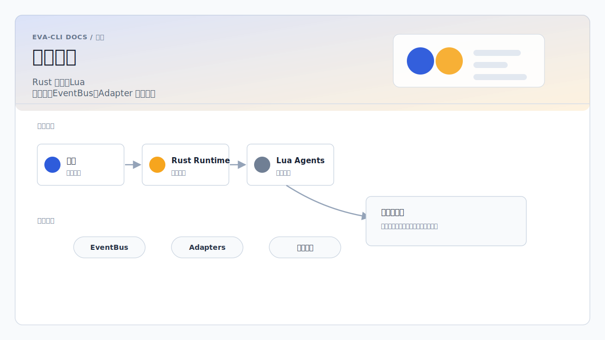

# Eva-CLI 总体架构方案



更新日期：2026-06-16

## 1. 文档定位

本文是 Eva-CLI 的总体架构入口，整合以下子方案：

- `README.md`：定义 `docs/` 目录阅读顺序、文档职责和核心边界。
- `Rust与Lua事件总线智能体调度架构方案.md`：定义 Rust + Lua + EventBus + Topic 的 Agent 调度核心。
- `Lua调用外部Agent动态Adapter架构方案.md`：定义 Lua 调用 Claude、Codex、MCP server、本地模型和内部 Agent 的动态 Adapter 扩展层。
- `Lua承载Skill-MCP-Tool热更新架构方案.md`：定义 Skill、MCP tool handler 和 Tool 的业务实现如何下沉到 Lua，并通过 Rust Capability Kernel 保持权限边界与热更新回滚能力。
- `Agent记忆与知识库架构方案.md`：定义 Agent 私有记忆、系统总记忆库、知识库、上下文构建、权限、审计和一致性边界。
- `Agent扫描与发现架构方案.md`：定义如何扫描、识别、校验并注册用户电脑上可用的内部 Agent、外部 Agent、CLI、MCP server 和 workflow skill。
- `外接硬件接入与热插拔架构方案.md`：定义 USB、串口、BLE、网络设备和厂商 SDK 设备如何通过 HardwareAdapter 接入，并支持热插拔、重连和硬件事件。
- `进程级停机升级架构方案.md`：定义系统重启恢复、Supervisor 托管 Runtime 自动升级、Runtime 兜底拉起 Supervisor、Runtime generation 双活切流、可恢复进程内 EventBus、状态快照、reattach 和回滚语义。
- `备份迁移包与ReleaseSnapshot架构方案.md`：定义备份、迁移包和 release snapshot 的可信执行为什么必须由 Runtime service 承担，Agent 只负责请求、编排、解释和总结。

总体结论：

- 系统核心是 **Rust 托管的 Topic EventBus Agent 运行时**。
- Agent 业务逻辑由 **Lua 脚本**承载，支持热更新和局部状态。
- Agent 之间通过 **Topic 事件**协作，不共享隐式全局状态。
- 用户电脑上的可用 Agent 能力通过 **AgentDiscoveryService** 扫描、归一化、校验和注册。
- Claude、Codex、Gemini、本地模型、MCP server 等外部能力通过 **动态 Adapter** 接入。
- USB、串口、BLE、网络设备和厂商 SDK 设备通过 **HardwareAdapter** 接入，热插拔和设备句柄由 Rust 托管。
- Codex/OMX workflow skill 通过 **SkillAdapter** 接入，不能由 Lua 直接读取或执行。
- 项目内可热更新的 Tool、Lua Skill 和 MCP tool handler 可以通过 **Lua Capability Runtime** 承载业务实现，但权限、schema、transport、审计和回滚继续由 Rust 托管。
- Agent 私有记忆、系统总记忆库和知识库通过 Rust Runtime 内的 **MemoryService / KnowledgeService / ContextBuilder** 托管，Lua Agent 只通过受控 `ctx.memory`、`ctx.global_memory` 和 `ctx.knowledge` API 使用，EventBus 只负责通知和链路。
- MCP 支持双向集成：内部 Agent 调用外部 MCP server；系统自身作为 MCP server 暴露受控工具。
- 进程级高可用升级通过 **OS service manager 根恢复 + Supervisor 主控 Runtime + Runtime 兜底恢复 Supervisor + Runtime generation 双活切流 + Recoverable In-Process EventBus + Durable Event Log + Snapshot / State Store** 实现。
- 备份、迁移包和 release snapshot 通过 **BackupService + MigrationPackageService + ReleaseSnapshotService + ArtifactStore + ManifestVerifier + AuditLog** 作为 Runtime 可信执行能力实现；Agent 只能通过受控 API 请求和解释，不能直接执行 restore、apply、rollback 或 release pointer 移动。

本文用于统一架构边界、模块关系、运行时流程、数据契约、可靠性、安全策略、配置策略和设计校验口径。具体 Topic 匹配、Adapter 协议和配置格式以对应子方案为准。

## 2. 目标与非目标

### 2.1 目标

- 构建一个可热更新、可扩展、可观测的多 Agent 调度系统。
- 使用 Rust 承担运行时、调度、权限、可靠性和外部能力托管。
- 使用 Lua 承担 Agent 业务逻辑、局部状态转换和轻量编排。
- 使用 Topic EventBus 实现 Agent 间解耦协作。
- 使用 AgentDiscoveryService 发现项目内 Agent、用户本地 workflow skill、白名单 CLI 和显式 MCP 配置。
- 使用 AdapterRegistry 接入外部 Agent、CLI、HTTP API、MCP server 和内部 Agent。
- 支持单进程、多进程、分布式和持久化消息队列等部署形态。

### 2.2 非目标

- 不复刻中心化 LangGraph 状态图。
- 不让 Lua 直接执行 shell 命令、读取密钥或连接外部 provider。
- 不让 Lua 直接扫描用户电脑或读取用户目录。
- 不将 Rust 动态库插件作为默认扩展机制。
- 不默认提供强一致分布式事务。
- 不把 EventBus 当作所有业务状态的存储系统。
- 不允许 MCP 成为不受控的通用代理。
- 不默认进行全盘扫描，也不把任意可执行文件注册为 Agent。
- 不让 Agent 直接实现备份、迁移包 apply、release snapshot、restore、rollback 或 release pointer 移动。

## 3. 总体架构

可视化总览图：


文本版主链路如下，便于复制到纯文本环境：

```text
             Startup / CLI scan / Config hot reload
                                |
                                v
                   [AgentDiscoveryService - Rust]
                                |
              +-----------------+-----------------+
              |                                   |
              v                                   v
 config/agents/**/agent.yaml              config/adapters/*.yaml
 config/agents/**/main.lua                ~/.codex/skills/*
                                          ~/.codex/prompts/*
                                          PATH allowlist commands
                                          MCP manifests
              |                                   |
              +-----------------+-----------------+
                                |
                                v
              Scheduler Registry / AdapterRegistry
                                |
                                v
                  External Input / CLI / API / UI
                                |
                                v
                      Event { topic, payload, meta }
                                |
                                v
                           [EventBus]
                                |
                                v
                        [Scheduler - Rust]
                                |
                +---------------+---------------+
                |               |               |
                v               v               v
           [Agent A]       [Agent B]       [Agent N]
           Lua State       Lua State       Lua State
           Inbox Queue     Inbox Queue     Inbox Queue
                |               |               |
                +---------------+---------------+
                                |
                                v
                        [Rust Tool Layer]
                                |
                                v
                       [AdapterRegistry]
                                |
                           [AdapterRouter]
                                |
      +-------------+-------------+-------------+-------------+-------------+--------------+-----------------+
      |             |             |             |             |             |              |                 |
      v             v             v             v             v             v              v
 BuiltinAdapter  StdioAdapter  HttpAdapter  EventBusAdapter  McpAdapter  SkillAdapter   HardwareAdapter
      |             |             |             |             |             |              |
      v             v             v             v             v             v              v
 Rust tools      Codex CLI     Claude API    Internal Agent   MCP server    Workflow Skill 外接硬件
                 Claude CLI    Gemini API    Local Agent      tools/resources              USB/串口/BLE
```

系统分为四层：

1. **发现层**：AgentDiscoveryService、scanner、normalizer、health check、discovery cache。
2. **调度层**：EventBus、Scheduler、Topic 路由、Agent 队列。
3. **执行层**：AgentRuntime、Lua State、Lua sandbox、Rust tool bindings。
4. **扩展层**：AdapterRegistry、AdapterRouter、MCP client/server、SkillAdapter、HardwareAdapter 和外部 provider。

## 4. 核心设计原则

### 4.1 Rust 管系统边界

Rust 负责不可妥协的系统能力：

- EventBus 和 Scheduler。
- AgentDiscoveryService、扫描白名单、发现缓存和注册入口。
- Agent 生命周期。
- 私有队列、超时、取消、重试和死信。
- Lua State 生命周期和沙箱。
- Adapter 注册、权限、路由和观测。
- MCP 连接、MCP server 暴露和 tool/resource/prompt 校验。
- 状态持久化、审计日志和链路追踪。

### 4.2 Lua 管业务意图

Lua 负责可热更新的业务逻辑：

- 识别事件意图。
- 更新 Agent 局部状态。
- 调用 Rust 白名单工具。
- 发布衍生 Topic 事件。
- 编排局部工作流。

Lua 不直接访问：

- shell。
- 文件系统。
- 网络。
- 环境变量。
- API key。
- MCP server session。

### 4.3 Topic 是系统级路由契约

事件使用路径式 Topic：

```text
/input/user
/task/created
/adapter/invoke
/mcp/tool/called
/sys/route-a/route-aa
```

Scheduler 必须按 `/` 分段匹配，支持：

```text
/sys/route-a       精确匹配
/sys/*             单段通配
/sys/**            多段尾部通配
```

不能用简单字符串前缀替代 Topic matcher。

`/sys` 是内部 Agent 层级路由根，例如：

```text
/sys
  -> /sys/route-a
      -> /sys/route-a/route-aa
```

默认不做父 Topic 到子 Topic 的自动递归投递。父级 Agent 处理完成后必须显式 `ctx.emit` 到子 Topic，例如 `agent-a` 处理 `/sys/route-a` 后发布 `/sys/route-a/route-aa`。

### 4.4 Adapter 是受控能力单元

Adapter 的定义：

```text
Adapter = manifest + capability + policy + transport + protocol + runtime state
```

Adapter 接入能力包括：

- Claude API。
- Codex CLI。
- Gemini API。
- 本地模型。
- 内部 Agent。
- MCP server。
- 系统内部 Agent。

所有 Adapter 都必须经过 Registry、Router 和 policy，不允许 Lua 绕过。

### 4.5 Discovery 是受控注册入口

AgentDiscoveryService 负责把用户电脑上可用的 Agent 能力转化为系统可理解、可校验、可注册的对象。

Discovery 的边界：

- 只扫描项目配置目录、用户显式配置目录、受信任 Codex/OMX 目录和白名单 PATH 命令。
- 发现内部 Lua Agent 后注册到 Scheduler。
- 发现外部 CLI、HTTP、MCP、本地模型和 workflow skill 后注册到 AdapterRegistry。
- 发现结果必须经过 schema、policy 和 health check。
- 发现不等于授权；授权不等于执行；执行仍必须经过 Rust Tool Layer 和 Adapter policy。

Lua 不允许直接调用 Discovery，也不允许通过 Discovery 扩大文件、网络或 shell 权限。

## 5. 核心模块

### 5.1 EventBus

EventBus 是全局事件发布通道。

EventBus 后端可以选择纯进程内 `broadcast`、可恢复进程内 EventBus、Redis Streams、NATS、Kafka、RabbitMQ 或 PostgreSQL LISTEN/NOTIFY。

- 纯进程内 `broadcast` 适合本地开发和可接受 best-effort 的轻量任务。
- 可恢复进程内 EventBus 使用内存快速分发 + 本地 Durable Event Log / WAL / Spool，适合单机高可用和系统重启恢复。
- 外部持久化队列适合跨进程、多机器和分布式运行。

职责：

- 接收外部输入和 Agent 发布的事件。
- 广播给 Scheduler、观测器和审计器。
- 不直接执行 Agent 业务逻辑。
- 不直接承担复杂 Topic 匹配。

### 5.2 Scheduler

Scheduler 是事件路由器。

职责：

- 订阅 EventBus。
- 维护 Agent 注册表。
- 维护 Topic 订阅表。
- 根据 `target`、Topic pattern、优先级和负载选择 Agent。
- 将事件投递到 Agent 私有队列。
- 处理 Agent 不在线、队列满和投递失败。
- 将失败事件写入死信队列。

默认路由优先级：

```text
target 直接路由
  -> 精确 Topic 订阅
  -> 通配 Topic 订阅
  -> 规则路由
```

### 5.3 AgentRuntime

每个 Agent 是独立运行单元：

- 独立 Tokio task。
- 独立 Lua State。
- 独立 bounded inbox queue。
- 独立局部状态。
- 独立超时和错误边界。
- 独立脚本版本。

Agent 处理流程：

```text
从 inbox 读取 Event
  -> 检查幂等和状态
  -> 调用 Lua on_event(event, ctx)
  -> Lua 调用 ctx.emit / ctx.tools
  -> Rust 记录 trace、状态、结果
```

### 5.4 Lua Sandbox

Lua 必须运行在受控环境：

- 禁用 `os`、`io`、`debug` 等危险库。
- 禁止直接访问文件、网络和环境变量。
- 所有外部能力通过 Rust 工具白名单暴露。
- 限制执行时间和内存。
- 校验 Lua 返回值和 Lua 发出的 Topic。
- CPU 密集任务下沉到 Rust worker 或独立进程。

### 5.5 Rust Tool Layer

Rust Tool Layer 是 Lua 能力边界：

```text
ctx.emit(topic, payload, options)
ctx.tools.invoke_agent(request)
ctx.tools.http_get(...)
ctx.tools.state_get(...)
ctx.tools.state_set(...)
```

所有工具调用都应：

- 有 schema。
- 有超时。
- 有权限。
- 有 tracing。
- 有结构化错误。

### 5.6 AgentDiscoveryService

AgentDiscoveryService 是运行时启动和手动扫描时的能力发现入口。

职责：

- 扫描 `config/agents/**/agent.yaml` 和同目录 Lua 脚本，发现内部 Lua Agent。
- 扫描 `config/adapters/*.yaml`、`config/mcp/*.yaml` 和用户显式配置，发现外部 Adapter。
- 扫描 `~/.codex/prompts/*.md`、`~/.codex/skills/*/SKILL.md`、`~/.agents/skills/*/SKILL.md` 等受信任目录。
- 查找 PATH 中的白名单命令，例如 `codex`、`claude`、`gemini`、`ollama`。
- 将不同来源归一化为 `DiscoveredAgent`。
- 执行 schema 校验、policy 预检查、轻量 health check。
- 写入 `.eva/data/discovery-cache.json`。
- 向 EventBus 发布 `/discovery/**` 事件。
- 将 Lua Agent 注册到 Scheduler，将外部能力注册到 AdapterRegistry。

Discovery 不做：

- 不全盘扫描。
- 不执行被扫描目录中的任意脚本。
- 不读取密钥内容。
- 不把任意可执行文件包装为 Agent。
- 不绕过 AdapterRegistry 和 policy。

### 5.7 AdapterRegistry 与 AdapterRouter

AdapterRegistry 负责：

- 接收 AgentDiscoveryService 发现并校验过的 Adapter manifest 或内置 Adapter template。
- 校验 manifest schema。
- 创建 transport runtime。
- 建立 capability 索引。
- 健康检查。
- 热加载、替换、卸载。

AdapterRouter 负责：

- 根据 provider 精确选择 Adapter。
- 根据 capability 自动选择 Adapter。
- 过滤不健康、超并发、权限不足的 Adapter。
- 根据优先级、负载和错误率评分。
- 返回结构化错误。

### 5.8 MCP 子系统

MCP 子系统包含两个方向：

```text
内部调用外部 MCP:
Lua Agent -> McpAdapter -> MCP server tools/resources/prompts

外部调用内部 Agent:
MCP Client -> Eva-CLI MCP Server -> EventBus / AdapterRegistry / Scheduler
```

MCP 边界：

- MCP tool 必须经过 allowlist。
- MCP resource 必须经过 URI allowlist。
- MCP prompt 必须经过 schema 校验。
- 外部 MCP client 不能任意发布内部 Topic。
- `agent.invoke`、`adapter.invoke` 等 MCP tools 必须有明确权限。

## 6. 关键数据契约

### 6.1 Event

```rust
pub struct Event {
    pub id: String,
    pub topic: String,
    pub source: String,
    pub target: Option<String>,
    pub correlation_id: Option<String>,
    pub causation_id: Option<String>,
    pub priority: EventPriority,
    pub payload: serde_json::Value,
    pub created_at: DateTime<Utc>,
}
```

### 6.2 Lua Agent 入口

```lua
function on_event(event, ctx)
  if event.topic == "/input/user" then
    ctx.emit("/agent/reply", {
      text = "..."
    })
  end
end
```

### 6.3 Adapter 调用请求

```rust
pub struct AgentInvokeRequest {
    pub request_id: String,
    pub capability: String,
    pub provider: Option<String>,
    pub prompt: Option<String>,
    pub payload: serde_json::Value,
    pub context: InvokeContext,
    pub timeout_ms: Option<u64>,
    pub stream: bool,
    pub reply_topic: Option<String>,
    pub stream_topic: Option<String>,
    pub correlation_id: Option<String>,
    pub causation_id: Option<String>,
}
```

### 6.4 DiscoveredAgent

```rust
pub struct DiscoveredAgent {
    pub id: String,
    pub name: Option<String>,
    pub kind: DiscoveredAgentKind,
    pub source: DiscoverySource,
    pub provider: Option<String>,
    pub capabilities: Vec<String>,
    pub manifest_path: Option<PathBuf>,
    pub command: Option<PathBuf>,
    pub args: Vec<String>,
    pub script_path: Option<PathBuf>,
    pub subscriptions: Vec<String>,
    pub enabled: bool,
    pub trust_level: TrustLevel,
    pub health: DiscoveryHealth,
    pub policy_ref: Option<String>,
    pub metadata: serde_json::Value,
}
```

`DiscoveredAgent` 是扫描阶段的中间对象，不是运行态 `AgentHandle`，也不是已经授权的 `AgentAdapter`。

## 7. 典型流程

### 7.1 启动扫描到注册

```text
Eva-CLI 启动
  -> 读取 config/eva.yaml
  -> AgentDiscoveryService 扫描项目 Agent、Adapter、MCP、用户 Codex/OMX 目录和白名单命令
  -> DiscoveryNormalizer 归一化为 DiscoveredAgent
  -> schema + policy 预检查
  -> health check
  -> 写入 discovery cache
  -> Lua Agent 注册到 Scheduler
  -> 外部能力注册到 AdapterRegistry
  -> EventBus 发布 /discovery/completed
```

### 7.2 用户输入到 Lua Agent

```text
CLI/API 发布 /input/user
  -> EventBus
  -> Scheduler 匹配 /input/user
  -> 投递到 PlannerAgent inbox
  -> PlannerAgent Lua on_event
  -> ctx.emit("/agent/reply")
```

### 7.3 `/sys` 层级 Agent 路由

```text
CLI/API 发布 /sys
  -> EventBus
  -> Scheduler 精确匹配 /sys
  -> root-agent 处理
  -> root-agent ctx.emit("/sys/route-a")
  -> Scheduler 精确匹配 /sys/route-a
  -> agent-a 处理
  -> agent-a ctx.emit("/sys/route-a/route-aa")
  -> Scheduler 精确匹配 /sys/route-a/route-aa
  -> agent-a11 和 agent-a12 并行处理
```

### 7.4 Lua 调用 Codex / Claude

```text
Lua ctx.tools.invoke_agent({
  capability = "repo.analyze",
  provider = "codex-cli"
})
  -> Rust Tool Layer
  -> AdapterRegistry
  -> AdapterRouter
  -> StdioAdapter
  -> Codex CLI
  -> AgentInvokeResponse
```

### 7.5 Lua 调用 MCP Tool

```text
Lua ctx.tools.invoke_agent({
  capability = "mcp.tool.call",
  provider = "github-mcp",
  payload.tool = "create_issue"
})
  -> McpAdapter
  -> MCP tools/list schema 校验
  -> MCP tool 调用
  -> 结构化结果返回 Lua
```

### 7.6 Lua 调用 Workflow Skill

```text
Lua ctx.tools.invoke_agent({
  capability = "workflow.code_review",
  provider = "code-review-skill"
})
  -> Rust Tool Layer
  -> AdapterRegistry
  -> AdapterRouter
  -> SkillAdapter
  -> 运行态 gate / schema / policy 校验
  -> 结构化结果返回 Lua
```

Lua 不传入 skill 路径、命令模板或环境变量。Skill 的来源、入口、输入输出 schema 和权限必须来自 manifest 与 policy。

### 7.7 外部 MCP Client 调用内部 Agent

```text
MCP Client 调用 agent.invoke
  -> Eva-CLI MCP Server
  -> 权限校验
  -> 转换为 /agent/invoke 或 /adapter/invoke
  -> EventBus / AdapterRegistry
  -> 内部 Agent 或外部 Adapter
  -> MCP tool result
```

### 7.8 Lua 热更新

```text
监听脚本变化
  -> 加载新 Lua State
  -> 执行 init / health_check
  -> 校验 Topic 订阅
  -> 暂停 Agent 接收新事件
  -> 等当前事件完成或超时取消
  -> 替换 Lua State 和订阅版本
  -> 失败则回滚
```

## 8. 状态与一致性

状态分层：

```text
Agent 局部状态
  -> 会话上下文、处理进度、脚本版本、已处理事件

Agent 私有记忆
  -> Agent 长期偏好、任务摘要、局部经验、工具使用模式

系统总记忆库
  -> 用户偏好、项目事实、架构决策、跨 Agent 共享经验

知识库
  -> 文档、代码片段、设计方案、外部资料索引和可引用 chunk

全局业务状态
  -> task、session、user、tool call、audit log

系统运行状态
  -> Agent status、Adapter health、subscription table、dead letter
```

纯进程内运行形态可使用 best-effort 事件投递。需要系统重启恢复、崩溃重放、双活切流或跨进程协作的运行形态应支持：

- accepted 事件先写 Durable Event Log。
- 关键事件落库。
- consumer ack / watermark。
- 已处理事件去重。
- Agent 状态版本。
- Adapter request 幂等。
- 外部副作用 idempotency key。
- 死信队列和失败重放。

## 9. 可靠性策略

### 9.1 投递语义

纯进程内后端：

- EventBus best-effort。
- Agent 私有队列 bounded。
- 队列满、Agent 不在线、目标不存在进入死信队列。

可恢复进程内后端：

- accepted 前写 Durable Event Log / WAL / Spool。
- 内存 EventBus 负责低延迟分发。
- Runtime 崩溃或系统重启后按 consumer watermark 重放未 ack 事件。
- Agent 侧幂等消费。
- 外部副作用使用 idempotency key。

持久化后端：

- 使用持久化消息队列。
- 至少一次投递。
- Agent 侧幂等消费。
- 外部副作用使用 idempotency key。

### 9.2 超时、取消与重试

必须统一处理：

- Agent 事件处理超时。
- Lua 执行超时。
- Adapter 调用超时。
- MCP tool 调用超时。
- 用户取消。
- Agent / Adapter 取消。

重试策略按 Topic 或 capability 配置。默认只自动重试无副作用能力，例如 `repo.analyze`、`code.review`、`chat.reply`。

### 9.3 死信队列

死信记录至少包含：

- 原始事件或 request。
- Topic / capability。
- 目标 Agent / Adapter。
- 命中的 subscription pattern。
- 失败原因。
- 重试次数。
- 最后错误。
- 时间戳。

## 10. 安全模型

### 10.1 Discovery 权限

Discovery 只能使用 Rust Runtime 授权的扫描来源：

- 项目配置目录。
- 项目 Agent 脚本目录。
- 用户显式配置目录。
- 受信任 Codex/OMX prompt 和 skill 目录。
- PATH 中的白名单命令。

Discovery 禁止：

- 全盘扫描。
- 扫描敏感目录。
- 读取密钥内容。
- 执行未知脚本。
- 执行非白名单命令。
- 将发现结果直接授权给 Lua。

Discovery 发现结果必须再经过 Adapter policy 或 Agent permission 校验。

### 10.2 Lua 权限

Lua 只能使用 Rust 暴露的白名单能力。禁止：

- 任意 shell。
- 任意文件读写。
- 任意网络连接。
- 任意环境变量访问。
- 直接连接 MCP server。

### 10.3 Adapter 权限

Adapter 权限来自：

```text
系统 policy
  -> adapter manifest
  -> 用户/会话 policy
  -> request 级约束
```

最终权限只能收紧，不能放宽。

### 10.4 MCP 权限

MCP 必须限制：

- 可连接的 MCP server。
- 可调用的 tools。
- 可读取的 resources。
- 可渲染的 prompts。
- 可暴露给外部 MCP client 的内部 tools。
- `topic.emit` 的 Topic pattern。
- `agent.invoke` 的 Agent allowlist。
- `adapter.invoke` 的 capability/provider allowlist。

## 11. 可观测性

所有链路必须带：

- `event_id`
- `request_id`
- `topic`
- `capability`
- `provider`
- `adapter_id`
- `agent_id`
- `correlation_id`
- `causation_id`
- `subscription_pattern`
- `script_version`
- `span_id`
- `latency_ms`
- `error_kind`

需要支持：

- 查询某个 correlation 的完整事件链。
- 查询某个 Agent 的处理历史。
- 查询某个 Topic 的订阅者。
- 查询某个 Adapter 的健康状态。
- 查询某个 capability 的候选 Adapter。
- 查询某个 MCP tool 的调用历史。
- 查询死信事件和重试记录。

## 12. 模块划分

```text
src/
  eventbus/
    event.rs
    memory.rs
    dead_letter.rs

  scheduler/
    registry.rs
    routing.rs
    subscription.rs
    topic.rs

  agent/
    runtime.rs
    state.rs
    lifecycle.rs

  discovery/
    service.rs
    scanner.rs
    normalizer.rs
    health.rs
    cache.rs
    error.rs
    sources/
      project_agents.rs
      project_adapters.rs
      codex.rs
      omx.rs
      path_commands.rs
      mcp.rs

  lua/
    loader.rs
    sandbox.rs
    bindings.rs
    hot_reload.rs

  adapter/
    manifest.rs
    registry.rs
    router.rs
    runtime.rs
    policy.rs
    protocol.rs
    transports/
      builtin.rs
      stdio.rs
      http.rs
      eventbus.rs
      mcp.rs
      skill.rs
      hardware.rs

  hardware/
    discovery.rs
    registry.rs
    driver.rs
    hotplug.rs
    policy.rs
    state.rs

  mcp/
    client.rs
    server.rs
    tool_mapping.rs
    policy.rs
    schema.rs

  tools/
    external_agent.rs
    http.rs
    llm.rs
    state.rs

  observability/
    tracing.rs
    metrics.rs
    audit.rs

  cli/
    run.rs
    emit.rs
    inspect.rs
    agent.rs
    adapter.rs
```

## 13. 能力范围

### 13.1 Topic Agent 调度能力

- 支持纯进程内、可恢复进程内或外部持久化 EventBus 后端。
- 支持 Durable Event Log / ack / watermark / replay 的可恢复事件语义。
- 支持 Scheduler 订阅 EventBus 并按 Topic 路由。
- 支持 Topic exact、`*`、`**` 分段匹配。
- 支持 `target` 直接路由优先于 Topic fan-out。
- 支持多个 Agent 独立 Tokio task 和独立 Lua State。
- 支持 Agent 私有 bounded inbox queue。
- 支持 Lua `on_event(event, ctx)` 入口。
- 支持 Lua 通过 `ctx.emit` 发布新 Topic 事件。
- 支持事件处理超时、死信队列和 tracing。

### 13.2 外部能力接入

- 支持 Adapter manifest。
- 支持 AdapterRegistry 和 AdapterRouter。
- 支持 builtin、stdio、http、eventbus、mcp、skill、hardware transport。
- 支持 capability 路由和 provider 指定路由。
- 支持 `ctx.tools.invoke_agent` 同步调用。
- 支持 `/adapter/invoke`、`/adapter/completed`、`/adapter/failed`、`/adapter/stream` 异步事件。
- 支持 Adapter 超时、取消、并发限制和结构化错误。
- 支持 Workflow Skill 作为受控 capability 接入。
- 支持 HardwareAdapter 作为受控外接硬件 capability 接入。
- 禁止 Lua 传入任意 command 或直接读取 provider 密钥。
- 禁止 Lua 传入任意 skill 路径或绕过 skill 运行态 gate。
- 禁止 Lua 直接访问设备路径、设备句柄或 raw IO。

### 13.3 MCP 双向集成

- 支持内部 Agent 通过 `McpAdapter` 调用外部 MCP server。
- 支持 MCP tool/resource/prompt allowlist。
- 支持 MCP schema 校验。
- 支持系统作为 MCP server 暴露受控工具。
- 支持 `agent.invoke`、`adapter.invoke`、`adapter.list`、`adapter.health` 等 MCP tools。
- 禁止外部 MCP client 调用未授权 Agent、Adapter 或 Topic。

### 13.4 Agent 扫描与发现

- 支持启动时扫描项目内部 Lua Agent。
- 支持启动时扫描项目 Adapter manifest。
- 支持手动 `eva agent scan`、`eva agent list`、`eva adapter scan` 和 `eva adapter list`。
- 支持发现白名单 PATH 命令，例如 `codex`、`claude`、`gemini`、`ollama`。
- 支持发现用户本地 Codex/OMX prompt 和 workflow skill。
- 支持 discovery cache。
- 支持 `/discovery/**` 观测事件。
- 支持按 trust level、health status、policy 过滤可注册能力。
- 禁止全盘扫描和未知命令自动注册。

## 14. 设计校验标准

Topic Agent 调度校验：

- CLI 可以发布 `/input/user`。
- Scheduler 可以按 Topic 精确和通配匹配投递。
- 至少两个 Agent 可独立运行。
- 每个 Agent 有独立 Lua State。
- Lua 可以 `ctx.emit` 发布事件。
- Lua 可以调用 Rust async 工具。
- Agent 超时进入死信。
- tracing 能看到 correlation 链路。

Adapter 校验：

- 可以加载 `adapters/*.yaml` 或等价 JSON manifest。
- 可以按 capability 路由 Adapter。
- 可以调用 Codex CLI 或模拟 StdioAdapter。
- 可以调用 HTTP Adapter。
- 可以调用 `skill` transport 的 Workflow Skill Adapter。
- 缺少输入输出 schema 或 runtime gate 不匹配的 skill 不会注册为普通 Adapter。
- Adapter 超时、取消、错误可结构化返回。
- Lua 不能传任意 command。
- Lua 不能传任意 skill 路径。

MCP 校验：

- McpAdapter 可以列出 allowlist 内 MCP tools。
- Lua 可以通过 `mcp.tool.call` 调用 MCP tool。
- MCP tool 参数不符合 schema 时被拒绝。
- 系统作为 MCP server 暴露 `agent.invoke`。
- 外部 MCP client 不能调用未授权 Agent、Adapter 或 Topic。

Discovery 校验：

- 可以扫描 `config/agents/**/agent.yaml` 并注册 Lua Agent。
- 可以扫描 `config/adapters/*.yaml` 并注册 Adapter。
- 可以发现 PATH 中的白名单命令。
- 可以输出 `eva agent scan --json`。
- 可以写入并读取 discovery cache。
- 无效 manifest 不会导致运行时 panic。
- Lua 不能触发未授权扫描或直接读取发现来源。

## 15. 风险与规避

| 风险 | 规避 |
| --- | --- |
| Topic 误匹配 | 分段 matcher，禁止 `starts_with` |
| 事件重复消费 | event id 去重，外部副作用 idempotency key |
| Lua 阻塞 | 独立 Lua State，事件处理 timeout，CPU 任务下沉 |
| Adapter 越权 | manifest + policy + request 级约束 |
| Skill 被当作任意脚本执行 | SkillAdapter 固定入口、schema、runtime gate、默认只读权限 |
| Discovery 越权 | 白名单目录、白名单命令、schema 校验、policy 预检查 |
| 自动扫描误注册 | 发现和授权分离，Unknown trust level 默认只展示 |
| MCP 变成通用代理 | tool/resource/prompt allowlist，MCP server tool policy |
| capability 语义漂移 | 统一命名规范，业务别名必须映射到具体 provider/tool |
| 隐式流程难调试 | correlation_id、causation_id、trace、audit |
| 状态分裂 | Agent 局部状态和全局业务状态显式建模 |
| 热更新破坏订阅 | 脚本版本和订阅版本一起校验、替换、回滚 |

## 16. 文档索引

- Topic 调度细节：`Rust与Lua事件总线智能体调度架构方案.md`
- 外部 Agent 和 Adapter 细节：`Lua调用外部Agent动态Adapter架构方案.md`
- Agent 扫描与发现细节：`Agent扫描与发现架构方案.md`
- 外接硬件接入与热插拔细节：`外接硬件接入与热插拔架构方案.md`
- 项目配置方案：`项目配置方案.md`
- 进程级停机升级方案：`进程级停机升级架构方案.md`
- Lua 承载 Skill / MCP / Tool 热更新方案：`Lua承载Skill-MCP-Tool热更新架构方案.md`
- MCP 官方规范参考：`https://modelcontextprotocol.io/specification/`

## 17. 当前缺陷与待补设计

当前文档已经定义目标架构，但实现前仍需补齐以下细节：

- `ctx.tools` 的 Lua binding API 需要固定错误返回、超时取消、异步句柄和 JSON/Lua 类型映射。
- `ctx.host` 的 Lua Capability host API 需要固定权限模型、错误返回、审计字段和 JSON/Lua 类型映射。
- `AdapterManifest`、`AgentManifest`、`CapabilityManifest`、MCP policy、SkillAdapter manifest 和 HardwareAdapter manifest 需要落成 JSON Schema。
- capability 命名规范需要形成集中注册表，防止不同文档或不同 Adapter 使用同名不同义。
- SkillAdapter 需要明确底层执行器：是复用 Codex/OMX CLI、内嵌解释器，还是内部 workflow runtime。
- MCP server transport 需要跟踪官方协议版本，特别是 stdio、HTTP/SSE 或后续 streamable HTTP 的兼容策略。
- output schema 失败时的降级策略需要明确：拒绝返回、返回 `OutputSchemaInvalid`，还是允许带 warning 的部分结果。
- 写 workspace 的 Adapter/skill 需要额外审计字段，例如 touched paths、diff summary 和回滚建议。
- HardwareAdapter 需要把设备匹配规则、logical binding、generation 和 raw IO policy 固化为可校验 schema。
- 外部 MCP client 的身份认证、会话隔离和 per-client rate limit 还需要单独细化。

## 18. 总结

Eva-CLI 的总体架构应落在 **Rust 托管运行时 + AgentDiscoveryService + Lua 热更新 Agent / Capability + Topic EventBus + 动态 Adapter + MCP 双向集成 + HardwareAdapter + OS service manager / Supervisor / Runtime 高可用升级恢复**。

Rust 负责边界、发现、注册和可靠性，Lua 负责业务意图，Topic 负责 Agent 间协作，Adapter 负责外部能力接入，MCP 负责与工具生态互通，HardwareAdapter 负责外接硬件的设备身份、热插拔和物理副作用边界。这样既能保持 Agent 业务逻辑灵活，又能避免 Lua 越权、外部 provider 失控、自动扫描误注册、硬件 raw IO 失控和事件链路不可观测。
